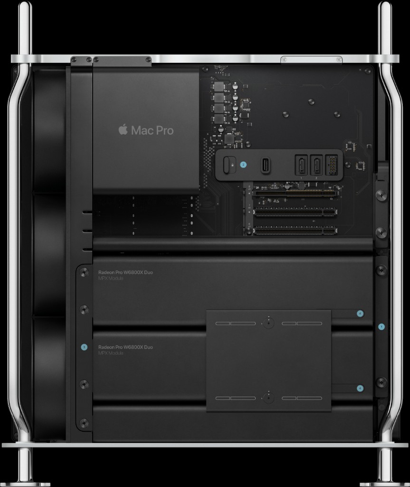

# ollama-metal

Ollama code that enables running local LLMs on the Apple Mac Pro with <b>AMD
Radeon Pro W6800X Duo card(s)</b>.

- Provides a <b>new Metal kernel</b> that runs GGUF models on AMD Radeon GPUs.
- Enables Ollama to detect one or more AMD Radeon dies and use them for GGUF
  Metal inference, running a separate LLM on each.
- Enables Ollama to split a single large model across dies, pooling their
  memory (~128 GB total) to run models too big for one card.
- Enables Ollama to detect and use the AMD Infinity Fabric linking the cards for
  direct die-to-die VRAM transfers.

## Benchmarks

<table>
<tr>
<td width="44%" valign="top">

<sub>Mac Pro (2019), two Radeon Pro W6800X Duo MPX modules &mdash; <b>4 GPU dies</b>, ~32&nbsp;GB each, non-UMA, linked by Infinity Fabric.</sub>
</td>
<td valign="top">

All numbers below are the same model &mdash; **llama3.2 3B Q4_K_M** &mdash;
measured through the patched `llama-server` `/completion` endpoint at
temperature 0 (t/s from `timings.*_per_second`).

**Single die** &mdash; backend comparison:

<table>
<tr><th align="left">Backend</th><th align="right">pp</th><th align="right">tg</th></tr>
<tr><td>Stock llama.cpp Metal <sub>(broken)</sub></td><td align="right">~2</td><td align="right">~2</td></tr>
<tr><td>CPU (28-thread Xeon W)</td><td align="right">216</td><td align="right">24</td></tr>
<tr><td>Patched Metal (ours)</td><td align="right"><b>473</b></td><td align="right"><b>73</b></td></tr>
</table>

**Cross-die layer split** &mdash; the same 3B model forced across N dies, VRAM-resident:

<table>
<tr><th align="left">Config</th><th align="right">pp</th><th align="right">tg<br><sub>host</sub></th><th align="right">tg<br><sub>fabric</sub></th></tr>
<tr><td>single die</td><td align="right">473</td><td align="right">73.0</td><td align="right">&mdash;</td></tr>
<tr><td>2-die split</td><td align="right">494</td><td align="right">68.7</td><td align="right">68.0</td></tr>
<tr><td>4-die split</td><td align="right">539</td><td align="right">51.0</td><td align="right">50.8</td></tr>
</table>

<sub>Splitting a model that already fits one die just exposes the split
<i>overhead</i>: tg falls (73 &rarr; 69 &rarr; 51) as the residual stream hops
more dies, while pp <i>rises</i> (473 &rarr; 539) since prompt eval is
compute-bound and parallelises. Split only for models &gt;32&nbsp;GB.
<b>tg fabric</b> (Infinity Fabric peer copy, <code>GGML_METAL_PEER_ENABLE</code>)
ties the host path. Full data: <a href="docs/benchmarks.md">docs/benchmarks.md</a></sub>

</td>
</tr>
</table>

**Larger models** &mdash; same `llama-server` harness, VRAM-resident
(`--no-mmap`), t/s @ temp 0:

<table>
<tr><th align="left">Model</th><th align="left">Config</th><th align="right">pp</th><th align="right">tg<br><sub>host</sub></th><th align="right">tg<br><sub>fabric</sub></th></tr>
<tr><td rowspan="3">gemma4 31B<br><sub>19&nbsp;GB, dense</sub></td><td>single die</td><td align="right">46.4</td><td align="right">11.4</td><td align="right">&mdash;</td></tr>
<tr><td>2-die split</td><td align="right">47.0</td><td align="right">11.1</td><td align="right">11.1</td></tr>
<tr><td>4-die split</td><td align="right">42.2</td><td align="right">10.4</td><td align="right">10.4</td></tr>
<tr><td rowspan="2">qwen3.5 122B<br><sub>81&nbsp;GB, MoE</sub></td><td>3-die <sub>(min&nbsp;fit)</sub></td><td align="right">~80</td><td align="right">27.6</td><td align="right">27.6</td></tr>
<tr><td>4-die split</td><td align="right">~75</td><td align="right">26.5</td><td align="right">25.6</td></tr>
</table>

<sub>gemma4 31B fits one die; splitting it costs almost nothing &mdash; it's
dense but bandwidth-bound (~11&nbsp;tg), so spreading layers barely changes the
per-token cost. qwen3.5 122B (81&nbsp;GB) <i>cannot</i> fit one die and needs
&ge;3; its MoE keeps tg high (~27&nbsp;t/s, only a few B params active). Fabric
ties the host path for both. Full data: <a href="docs/benchmarks.md">docs/benchmarks.md</a></sub>

## Supported hardware

This is the only configuration it's built and tested against:

- Mac Pro 2019 (MacPro7,1), Intel Xeon W, macOS 26.x
- 2x AMD Radeon PRO W6800X Duo = 4 dies, ~32 GB each, non-UMA
- Xcode + Metal, Go (MacPorts), MacPorts cmake/ninja/git

## Repo layout

```
LLAMA_CPP_VERSION   pinned upstream llama.cpp tag we patch (mirrors Ollama)
OLLAMA_VERSION      pinned Ollama tag + commit we integrate with
.cursorrules        architecture + repatching strategy (read this first)
docs/               architecture.md, repatching.md, benchmarks.md
patches/            git patches: patches/llama-cpp/ and patches/ollama/
reference/          verbatim iRon-Llama b6123 kernels (MIT) for provenance/port
scripts/            env / bootstrap / apply-patch / build / bench / install-app
bench/              curated benchmark results
```

## Quick start

Out of the box, Ollama on macOS accelerates inference through Apple's MLX
framework, which targets M-series chips: it assumes the `simdgroup_matrix`
intrinsics found only on Apple Silicon and builds on Apple's unified memory
architecture. On an Intel Mac with discrete AMD GPUs none of that applies, so
Ollama falls back to running models on the CPU. 


```sh
scripts/bootstrap.sh              # clone Ollama + llama.cpp at the pinned versions
scripts/apply-patch.sh            # apply patches/ onto the work/ checkouts
BUILD_MODE=local scripts/build.sh # build Ollama against the patched llama.cpp tree
scripts/bench.sh llama3.2         # correctness + speed vs CPU baseline
```

## Using it with the official Ollama.app

The desktop app from [ollama.com](https://ollama.com/download/Ollama.dmg) is a
native menubar app: it spawns `Contents/Resources/ollama serve`, which spawns
`Contents/Resources/llama-server`. On an Intel Mac it ships CPU-only, since the
stock ggml Metal backend is gated to arm64. You can swap in our patched
x86_64 builds to keep the menubar UI and get the GPUs:

```sh
BUILD_MODE=local scripts/build.sh   # produce the patched binaries
scripts/install-app.sh              # back up + replace the app's ollama + llama-server
                                    # (ad-hoc re-signs them; version-checked)
```

Then launch Ollama as usual. To confirm it took, watch
`~/.ollama/logs/server.log` for `MTL0..MTL3` and `mmap = false`. Revert any time
with `scripts/uninstall-app.sh`.

A few things to know:

- Both binaries get replaced: `llama-server` (the Metal compute) and the
  `ollama` Go server (the discrete-Metal mmap disable and multi-die discovery).
- macOS protects `/Applications/Ollama.app`, so the first run needs the
  permission prompt (or Full Disk Access for the script).
- Re-run `install-app.sh` after every Ollama update, because the updater puts
  the stock CPU-only binaries back. If the new app version doesn't match
  `OLLAMA_VERSION`, the script will tell you to re-pin and rebuild first.


Built as a small set of patches on top of pinned upstream Ollama and llama.cpp
(not a fork), porting the AMD-friendly Metal kernels from
[`Basten7/iRon-Llama`](https://github.com/Basten7/iRon-Llama).

## License

MIT. Derives from MIT-licensed llama.cpp, Ollama, and iRon-Llama; their
attributions are retained (see `LICENSE` and
`reference/iron-llama-b6123/UPSTREAM-README.md`).
