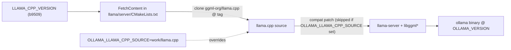

# Architecture

## The problem, precisely

Three independent facts combine to make Ollama run GGUF models on CPU on an
Intel Mac Pro with AMD GPUs:

1. **Ollama gates ggml-Metal to arm64.** Since v0.19 (March 2026) Ollama's
   primary Mac GPU engine is MLX (Apple Silicon, unified memory). It still uses
   the llama.cpp/ggml Metal backend for GGUF, but only builds it for arm64. On
   x86_64 the backend is compiled out and inference falls back to CPU. Ollama's
   own server log shows `inference compute id=cpu library=cpu`.

2. **Stock llama.cpp Metal is unusable on these GPUs.** Its `mul_mm` matmul
   kernels require Apple-GPU `simdgroup_matrix` intrinsics. The W6800X reports
   `simdgroup matrix mul. = false`, so matmul falls back to a slow path:
   measured ~2 t/s (vs ~30 t/s on the CPU).

3. **No unified memory.** The W6800X is a discrete PCIe card
   (`has unified memory = false`), so every tensor crosses the bus and the
   Apple-tuned, concurrency-heavy code paths misbehave (historically garbage
   output on discrete AMD until non-UMA fixes landed upstream).

## The fix (kernels)

`Basten7/iRon-Llama` rewrote the Metal matmul path for AMD:
- Report `has_simdgroup_reduction` for `MTLGPUFamilyMetal3`/`Mac2`.
- Force `has_simdgroup_mm = false` (do not use Apple matrix intrinsics).
- Enable the matmul kernel set when `has_simdgroup_mm || !has_unified_memory`,
  i.e. load **threadgroup-tiled** `mul_mm`/`mul_mm_id` GEMM kernels on
  non-UMA AMD instead of the Apple simdgroup path.
- Keep `flash_attn_ext` off on AMD (`!has_unified_memory || !has_simdgroup_mm`).
- Select the device via `MTLCopyAllDevices()` + `GGML_METAL_DEVICE_INDEX`.

The `.metal` shader file carries ~1200 lines of these tiled kernels. The fork's
base is llama.cpp `b6123`; we vendor those two files verbatim under
`reference/iron-llama-b6123/` and port the semantics forward to Ollama's pin.

## How Ollama assembles the GGML backend

Key files in the Ollama tree (`OLLAMA_VERSION` = v0.30.6):
- `LLAMA_CPP_VERSION` - the upstream llama.cpp tag (source of truth).
- `llama/server/CMakeLists.txt` - FetchContent + `OLLAMA_LLAMA_CPP_SOURCE`
  override (skips compat patch on override).
- `llama/compat/` - in-memory GGUF blob compat shim (irrelevant to GPU; skipped
  under our source override).
- `scripts/build_darwin.sh` - amd64 branch (`CMAKE_ARCH=x86_64`,
  `metal_v3`); where we ensure the Metal backend is built and installed.
- `discover/` + `ml/` - GPU enumeration and device reporting (we add AMD-Metal
  on x86_64 here so the scheduler offloads layers).

## Our integration point

We do NOT patch Ollama's vendored ggml (it commits only `ggml-cuda`; everything
else is fetched). Instead:
1. Patch a clean local checkout of llama.cpp `b9509` with the AMD-Metal kernels
   and the x86_64 build un-gating.
2. Build Ollama with `OLLAMA_LLAMA_CPP_SOURCE=work/llama.cpp` so it links our
   patched tree (and skips the compat patch).
3. Patch Ollama's Go discovery/scheduler so it reports the AMD die(s) and
   offloads to them.

This keeps the bulk of the change (kernels) as a llama.cpp patch decoupled from
Ollama's Go, and a small, separate Ollama patch for discovery/build.

## Multi-die model

- Phase A (done): single die, the big win. Correctness via concurrency-off,
  perf via mmap-off; automatic by default.
- Phase B (done): the ggml-metal backend registers one `ggml_backend_device`
  per physical die by default (`ggml_metal_device_count()` ->
  `MTLCopyAllDevices()[i]`), so a single `ollama serve` discovers `MTL0..MTL3`.
  Ollama already places one model per GPU (`bestSingleGPUFit`); the patches make
  it work for Metal by (1) classifying `MTL<n>` devices as the `Metal` library,
  (2) exporting `GGML_METAL_DEVICE_INDEX` to pin each runner to its die
  (g_devices collapses to 1 in that process), and (3) attributing a pinned
  runner's whole footprint to its die for VRAM accounting. No cross-device
  tensors needed. Validated: 3 models concurrent on 3 dies. Cap with
  `OLLAMA_MAX_LOADED_MODELS=4`; `OLLAMA_SCHED_SPREAD` opts into cross-die split.
- Phase C (done): cross-die layer split for single models >32 GB. The only
  change needed was correctness: `ggml_metal_cpy_tensor_async` and
  `ggml_metal_buffer_cpy_tensor` issue a Metal blit between the src and dst
  buffers, which is invalid across two physical `MTLDevice`s by default. Both now
  return false when the devices differ, so ggml-backend uses its host-mediated
  copy (`get_tensor` src -> host -> `set_tensor` dst, both same-device blits via
  the bounce-buffered path). ggml-sched then splits layers across dies normally
  (`-sm layer`); Ollama routes here automatically when a model does not fit one
  die (`bestGPUGroupByAvailableMemory`) or when `OLLAMA_SCHED_SPREAD=1`.
  Validated coherent on a forced 2-die split and an Ollama 4-die spread. The
  split overhead is small (NOT PCIe-bandwidth-bound as first assumed): with
  weights resident in VRAM (`--no-mmap`), devstral 24B runs ~75 t/s single-die
  vs ~70 t/s on a 2-die layer split. The cross-die copy is only the residual
  stream (~10-20 KB/token), so the ~1 ms/token cost is submission/sync latency.
  The trade buys capacity up to ~128 GB. Single-die and one-model-per-die paths
  never hit this code (no cross-device copies), so they keep full speed.
- Phase D (done, opt-in): Infinity Fabric peer copy. All four dies share one
  Metal peer group (`peerGroupID`, `peerCount=4`), so the cross-die copy can go
  directly over the AMD Infinity Fabric Link via a remote buffer view
  (`newRemoteBufferViewForDevice:`) rather than through the host. Verified
  correct and ~9x faster as a raw transfer (~26 vs ~3 GB/s for 256 MB), but it
  gives **no measurable inference speedup** (70.1 peer vs 70.3 host t/s on the
  2-die split) because the per-token cross-die payload is tiny and the overhead
  is latency, not bandwidth. So `ggml_metal_buffer_cpy_tensor` only takes the
  peer path when `GGML_METAL_PEER_ENABLE` is set; default stays Phase C.

Correction to an earlier assumption: there IS a fast peer-to-peer path between
dies (Infinity Fabric peer group, Phase D), but it does not help layer-split
inference, and llama.cpp Metal does not do tensor-parallel (`-sm row`) across
discrete dies, so a tensor-parallel speedup is still not realized. Multi-die is
for capacity and concurrent throughput. There is no Ollama/llama.cpp flag for
Infinity Fabric (stock P2P knobs are CUDA-only); Phase D is the only way it is
exercised here.
