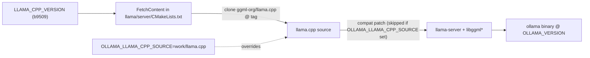

# Architecture

## The problem, precisely

Three independent facts combine to make Ollama run GGUF models on CPU on an
Intel Mac Pro with AMD GPUs:

1. **Ollama gates ggml-Metal to arm64.** Since v0.19 (March 2026) Ollama's
   primary Mac GPU engine is MLX (Apple Silicon, unified memory). It still uses
   the llama.cpp/ggml Metal backend for GGUF, but only builds it for arm64. On
   x86_64 the backend is compiled out and inference falls back to CPU. Ollama's
   own server log shows `inference compute id=cpu library=cpu`.

2. **Stock llama.cpp Metal is unusable on these GPUs.** Its `mul_mm` matmul
   kernels require Apple-GPU `simdgroup_matrix` intrinsics. The W6800X reports
   `simdgroup matrix mul. = false`, so matmul falls back to a slow path:
   measured ~2 t/s (vs ~30 t/s on the CPU).

3. **No unified memory.** The W6800X is a discrete PCIe card
   (`has unified memory = false`), so every tensor crosses the bus and the
   Apple-tuned, concurrency-heavy code paths misbehave (historically garbage
   output on discrete AMD until non-UMA fixes landed upstream).

## The fix (kernels)

`Basten7/iRon-Llama` rewrote the Metal matmul path for AMD:
- Report `has_simdgroup_reduction` for `MTLGPUFamilyMetal3`/`Mac2`.
- Force `has_simdgroup_mm = false` (do not use Apple matrix intrinsics).
- Enable the matmul kernel set when `has_simdgroup_mm || !has_unified_memory`,
  i.e. load **threadgroup-tiled** `mul_mm`/`mul_mm_id` GEMM kernels on
  non-UMA AMD instead of the Apple simdgroup path.
- Keep `flash_attn_ext` off on AMD (`!has_unified_memory || !has_simdgroup_mm`).
- Select the device via `MTLCopyAllDevices()` + `GGML_METAL_DEVICE_INDEX`.

The `.metal` shader file carries ~1200 lines of these tiled kernels. The fork's
base is llama.cpp `b6123`; we vendor those two files verbatim under
`reference/iron-llama-b6123/` and port the semantics forward to Ollama's pin.

## How Ollama assembles the GGML backend

Key files in the Ollama tree (`OLLAMA_VERSION` = v0.30.6):
- `LLAMA_CPP_VERSION` - the upstream llama.cpp tag (source of truth).
- `llama/server/CMakeLists.txt` - FetchContent + `OLLAMA_LLAMA_CPP_SOURCE`
  override (skips compat patch on override).
- `llama/compat/` - in-memory GGUF blob compat shim (irrelevant to GPU; skipped
  under our source override).
- `scripts/build_darwin.sh` - amd64 branch (`CMAKE_ARCH=x86_64`,
  `metal_v3`); where we ensure the Metal backend is built and installed.
- `discover/` + `ml/` - GPU enumeration and device reporting (we add AMD-Metal
  on x86_64 here so the scheduler offloads layers).

## Our integration point

We do NOT patch Ollama's vendored ggml (it commits only `ggml-cuda`; everything
else is fetched). Instead:
1. Patch a clean local checkout of llama.cpp `b9509` with the AMD-Metal kernels
   and the x86_64 build un-gating.
2. Build Ollama with `OLLAMA_LLAMA_CPP_SOURCE=work/llama.cpp` so it links our
   patched tree (and skips the compat patch).
3. Patch Ollama's Go discovery/scheduler so it reports the AMD die(s) and
   offloads to them.

This keeps the bulk of the change (kernels) as a llama.cpp patch decoupled from
Ollama's Go, and a small, separate Ollama patch for discovery/build.

## Multi-die model

- Phase A: single die (`GGML_METAL_DEVICE_INDEX`), the big win.
- Phase B: register each `MTLCopyAllDevices()` device as a separate
  `ggml_backend_device` with its own context/queue/buffers; report all dies to
  Ollama; place one model per die (`OLLAMA_SCHED_SPREAD`,
  `OLLAMA_MAX_LOADED_MODELS`). No cross-device tensors needed.
- Phase C (optional): host-mediated cross-die `set/get/cpy_tensor` + ggml
  backend-sched layer split for single models >32 GB. Expect ~single-die speed.

Non-UMA means there is no fast peer-to-peer path between dies; tensor-parallel
speedup is not feasible. Multi-die is for capacity and concurrent throughput.
